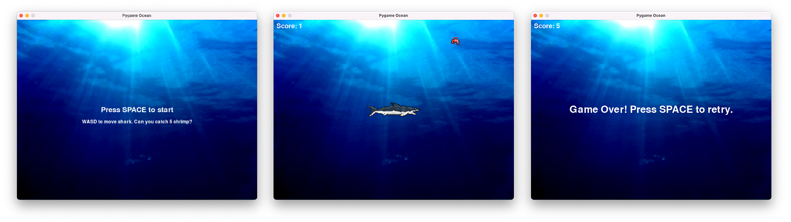

# Game States in Pygame
At some point, you might want to package your program with a set of opening and closing screens. For example, a game might have an opening screen with instructions, and a game over screen.



For this example, I'll be packaging my moving shark demo from the previous [Pygame Collisions](https://github.com/davecheng-ste/ICS3U-Pygame-Collisions) repo. You can see the game-only program in the file [`1-game_only.py`](1-game_only.py) in this repo.

<br><br>

## Defining game states using constants and variables
Try running the example [`2-game_states.py`](2-game_states.py) in this repo. We have three game states:

- Opening screen with instructions. The user presses `SPACE` to begin playing.
- Gameplay state. This is the main game.
- Game over screen. The user can press `SPACE` to play again.

To achieve this, we can assign an integer value to each state as constants:

```python
# Game states
OPENING = 0
PLAYING = 1
GAME_OVER = 2
```

Then, we can create a `game_state` variable and assign it with the defined constants:

```python
# Initialize game conditions
game_state = OPENING
```

While the use of game state constants are not a necessity, it does make the code easier to read. For example, this event handler for `pygame.K_SPACE` only runs at the opening and game over screens:

```python
if event.key == pygame.K_SPACE:
    if game_state == OPENING or game_state == GAME_OVER:
        game_state = PLAYING
        player_score = 0
        text_score_string = f"Score: {player_score}"
        text_score_surface = font_score.render(text_score_string, True, WHITE)
        shrimp_rect.left = WIDTH
        shark_rect.centerx = WIDTH // 2
        shark_rect.centery = HEIGHT // 2
```

Here is the same code using only integer values:

```python
if event.key == pygame.K_SPACE:
    if game_state == 0 or game_state == 2:
        game_state = 1
        player_score = 0
        text_score_string = f"Score: {player_score}"
        text_score_surface = font_score.render(text_score_string, True, WHITE)
        shrimp_rect.left = WIDTH
        shark_rect.centerx = WIDTH // 2
        shark_rect.centery = HEIGHT // 2
```

Which one is easier to understand?

<br><br>

## Going further with functions
We can abstract the program logic even further by containing much of the game logic in functions. See the example in the file [`3-game_states_functions.py`](3-game_states_functions.py) in this repo. 

We're using the same `game_state` variable and constant values as the previous example. Now, our main game loop looks like this:

```python
# Main game loop
running = True
while running:
    if not handle_events():
        break

    if game_state == PLAYING:
        handle_key_presses()
        handle_shrimp_movement()
        handle_collisions()
        update_animation_frames()
        draw_playing_state()
    elif game_state == OPENING:
        draw_opening_state()
    elif game_state == GAME_OVER:
        draw_game_over_state()
    
    pygame.display.flip()
    clock.tick(30)
```

Referring to the rubric for your CPT, this would be a Level 4 example of subprogram structures or function usage.


### Logical structure
In particular, note that the `PLAYING` state follows the *input - processing - output* model in terms of how our program handles the game events:

```python
if game_state == PLAYING:
    handle_key_presses()
    handle_shrimp_movement()
    handle_collisions()
    update_animation_frames()
    draw_playing_state()
```

In order, we have:

#### INPUT
- `handle_key_presses()` looks for user **input**, in this case, the WASD keys to move the shark.

#### PROCESSING
- `handle_shrimp_movement()`, `handle_collisions()`, and `update_animation_frames()` **process** the new positions of the sprites, checks for collisions, and change the sprite animations.

#### OUTPUT
- `draw_playing_state()` then **outputs** (or blits) the graphics to the screen in the updated positions.

As you get closer to the end of your project, consider spending some time to refactor your code for this Level 4 example of abstraction and modularity. 